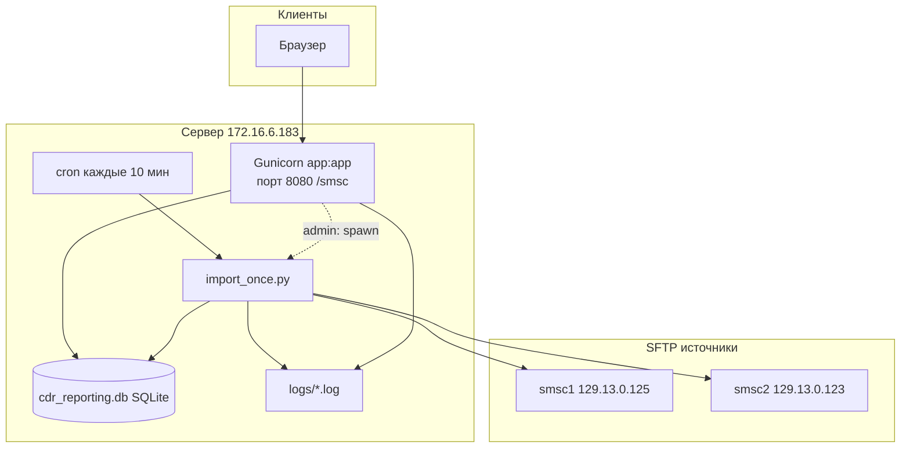

# SMSC CDR Reporting — полный мануал

Версия документа: май 2026  
Сервер production: `172.16.6.183`, путь `/opt/smsc`, URL `http://172.16.6.183:8080/smsc/`

---

## Содержание

1. [Назначение системы](#1-назначение-системы)
2. [Архитектура](#2-архитектура)
3. [Структура каталогов](#3-структура-каталогов)
4. [База данных](#4-база-данных)
5. [Импорт CDR — как работает](#5-импорт-cdr--как-работает)
6. [Веб-интерфейс и роли](#6-веб-интерфейс-и-роли)
7. [Переменные окружения](#7-переменные-окружения)
8. [Production на сервере](#8-production-на-сервере)
9. [Описание каждого файла](#9-описание-каждого-файла)
10. [Эксплуатация — команды](#10-эксплуатация--команды)
11. [Типичные проблемы](#11-типичные-проблемы)

---

## 1. Назначение системы

**SMSC CDR Reporting** — веб-приложение для:

- загрузки CDR (Call Detail Records) с двух SMSC-серверов по **SFTP** (или из локальных папок);
- хранения в **SQLite**;
- просмотра с фильтрами (дата, номер, статус, сервер, входящее соединение);
- экспорта в **CSV**;
- **автоимпорта** по cron (каждые 10 минут);
- аудита действий пользователей.

Дедупликация: одна запись CDR уникальна по паре `(cdr_id, source_server)`.

---

## 2. Архитектура



| Компонент | Процесс | Назначение |
|-----------|---------|------------|
| **Gunicorn** | `systemctl --user smsc` | HTTP, login, отчёты, export |
| **import_once.py** | cron + кнопка Import (subprocess) | Парсинг SFTP → БД |
| **import_runner.py** | библиотека | Общая логика batch, lock, retention |
| **ingestion.py** | библиотека | SFTP, выбор файлов, парсинг строк |
| **db.py** | библиотека | ORM-модели, миграции SQLite |

**Важно:** длинный импорт **не** выполняется внутри worker Gunicorn — только отдельный процесс `import_once.py`.

---

## 3. Структура каталогов

```
smsc/
├── app.py                 # Flask: веб, auth, UI routes
├── db.py                  # SQLAlchemy модели, create_session_factory
├── ingestion.py           # SFTP/local, выбор файлов, run_import
├── import_runner.py       # batch импорта, lock, stale, purge 90 дней
├── import_once.py         # CLI для cron и web subprocess
├── manage_users.py        # CLI пользователей
├── config.yaml            # источники SFTP (секреты!)
├── config.yaml.example    # шаблон без паролей
├── requirements.txt       # Python-зависимости
├── cdr_reporting.db       # SQLite (не коммитить)
├── logs/
│   ├── app.log            # веб, login, spawn import
│   ├── import.log         # детали парсинга
│   ├── audit.log          # аудит (дубль в БД)
│   ├── cron-import.log    # stdout cron
│   └── web-import.log     # stdout ручного import
├── templates/
│   ├── index.html         # главная: фильтры, CDR, import UI
│   └── login.html         # форма входа
├── deploy/
│   ├── smsc-user.service  # systemd user unit
│   ├── smsc.service       # system unit (если есть sudo)
│   └── smsc-import.cron   # пример crontab
├── docs/
│   ├── MANUAL.md          # этот документ
│   └── TECH_SPEC.md       # исходное ТЗ
└── scripts/               # деплой и диагностика (см. раздел 9)
```

---

## 4. База данных

Файл: `cdr_reporting.db` (SQLite 3, режим **WAL**).

### Таблицы

| Таблица | Назначение |
|---------|------------|
| **cdr_records** | Строки CDR (звонки/события) |
| **import_batches** | Один «запуск» импорта (кнопка или cron) |
| **import_jobs** | Импорт по одному источнику (smsc1/smsc2) внутри batch |
| **import_cursors** | Позиция инкрементального импорта по источнику |
| **source_file_states** | Какие файлы уже обрабатывались (mtime/size) |
| **users** | Логины веб-интерфейса |
| **audit_logs** | Кто что делал (login, export, import, просмотр) |

### cdr_records — поля

| Поле | Описание |
|------|----------|
| event_time | Дата/время события из CDR |
| cdr_id | ID записи CDR |
| incoming_connection | Входящее соединение |
| outgoing_route | Исходящий маршрут |
| a_msisdn, b_msisdn | Номера A/B |
| a_msisdn_translated, b_msisdn_translated | Переведённые номера |
| status | success / failed / error |
| source_server | smsc1 или smsc2 |
| source_file | Имя файла на SFTP |
| raw_line | Исходная строка CSV |

**Retention:** записи старше **90 дней** (`SMSC_CDR_RETENTION_DAYS`) удаляются из `cdr_records` после каждого импорта. Остальные таблицы не чистятся автоматически.

### import_batches / import_jobs

- **batch** — один клик Import или один запуск cron.
- **job** — результат по каждому `source` из `config.yaml`.
- Статусы batch: `running`, `success`, `partial`, `failed`.
- `progress_json` — JSON для UI (баннер «Import in progress»): `processed`, `selected`, `source`, `current_file`, `updated_at`.

---

## 5. Импорт CDR — как работает

### 5.1 Режимы выбора файлов (`ingestion._select_files_for_import`)

| Режим | Когда | Что берёт |
|-------|-------|-----------|
| **backfill** | Указаны даты From/To (admin) | Файлы в диапазоне дат, пропуск неизменённых |
| **phased bootstrap** | Пустая БД по файлам | По одному дню месяца (env `SMSC_BOOTSTRAP_YEAR/MONTH`) |
| **incremental** | Есть данные в БД | Recheck изменённых + новые после курсора |

Лимит: **500 файлов за запуск** на источник (`SMSC_MAX_FILES_PER_RUN`).

### 5.2 Цепочка запуска

**Cron (каждые 10 мин):**
```bash
cd /opt/smsc && set -a && [ -f .env ] && . ./.env; set +a && \
  .venv/bin/python import_once.py >> logs/cron-import.log 2>&1
```

**Кнопка Import (admin):** `app._spawn_import_process()` → subprocess:
```bash
.venv/bin/python import_once.py --triggered-by web [--from DATE] [--to DATE]
```

**Внутри import_once / import_runner:**
1. `reconcile_stale_running_batches()` — сброс зависших `running`
2. Если ещё `running` → `skipped_running`
3. `import_file_lock()` — файл `logs/import.lock`
4. Создать `ImportBatch`, для каждого source → `run_import()`
5. `purge_old_cdr_records()` — удалить CDR > 90 дней

### 5.3 «Зависший» импорт (stale)

Проверка при **каждом новом** запуске import (не во время текущего парсинга):

| Правило | По умолчанию |
|---------|----------------|
| Batch running дольше | **600 мин (10 ч)** |
| Нет обновления progress_json | **30 мин** |
| В БД running, но lock свободен | **3 мин** (сирота) |

---

## 6. Веб-интерфейс и роли

URL: `http://<host>:8080/smsc/`

### Маршруты (`app.py`, blueprint `smsc`)

| URL | Метод | Кто | Действие |
|-----|-------|-----|----------|
| `/smsc/login` | GET/POST | все | Вход |
| `/smsc/logout` | POST | все | Выход |
| `/smsc/` | GET | авторизован | Главная, фильтры, CDR |
| `/smsc/import` | POST | **admin** | Запуск import subprocess |
| `/smsc/import/status` | GET | авторизован | JSON прогресса (polling) |
| `/smsc/export.csv` | GET | авторизован | CSV по фильтрам |
| `/favicon.ico` | GET | все | 204 (пусто) |

### Роли

| Возможность | admin | Amirhon (обычный) |
|-------------|-------|-------------------|
| Просмотр CDR, фильтры, export | да | да |
| Жёлтый баннер «Import in progress» | да | да |
| Кнопки Import / Backfill | да | **нет** |
| Таблицы Import runs / jobs | да | **нет** |

Поле `users.is_admin` в БД; при каждом запросе проверяется `_user_is_admin()`.

---

## 7. Переменные окружения

Файл на сервере: `/opt/smsc/.env` (подхватывает systemd и cron).

| Переменная | По умолчанию | Описание |
|------------|--------------|----------|
| `SMSC_REPORTING_SECRET` | change-this... | Секрет Flask-сессии |
| `SMSC_ADMIN_USER` | admin | Имя bootstrap-admin |
| `SMSC_ADMIN_PASSWORD` | admin123 | Пароль bootstrap-admin |
| `SMSC_URL_PREFIX` | /smsc | Префикс URL |
| `SMSC_MAX_FILES_PER_RUN` | 500 | Файлов за запуск на source |
| `SMSC_CDR_RETENTION_DAYS` | 90 | Хранить CDR (дней) |
| `SMSC_IMPORT_STALE_MINUTES` | **600** | 10 ч — stale batch по времени старта |
| `SMSC_IMPORT_PROGRESS_STALE_MINUTES` | 30 | Stale без прогресса |
| `SMSC_IMPORT_ORPHAN_GRACE_MINUTES` | 3 | Сирота без lock |
| `SMSC_BOOTSTRAP_YEAR` | 2026 | Bootstrap месяц |
| `SMSC_BOOTSTRAP_MONTH` | 5 | Bootstrap месяц |
| `SMSC_FILE_OK_RATIO` | 0.95 | Доля OK строк для «успешного» файла |
| `SMSC_PYTHON` | sys.executable | Python для subprocess import |

---

## 8. Production на сервере

| Параметр | Значение |
|----------|----------|
| Хост | 172.16.6.183 |
| Пользователь OS | sorbon |
| Каталог | /opt/smsc |
| Venv | /opt/smsc/.venv |
| Сервис | `systemctl --user start smsc` |
| Gunicorn | 1 worker, timeout 120s, 0.0.0.0:8080 |
| Cron | `crontab -l` у sorbon |

### Проверка здоровья

```bash
export XDG_RUNTIME_DIR=/run/user/$(id -u)
systemctl --user status smsc
curl -s -o /dev/null -w '%{http_code}\n' http://127.0.0.1:8080/smsc/login
tail -f /opt/smsc/logs/import.log
```

### После перезагрузки сервера

Нужен **linger** (один раз с sudo):
```bash
sudo loginctl enable-linger sorbon
```

---

## 9. Описание каждого файла

### Ядро приложения

#### `app.py` — веб-сервер Flask

| Блок | Строки / функции | Назначение |
|------|------------------|------------|
| Конфиг | `URL_PREFIX`, `DB_URL`, loggers | Пути, секреты, 3 логгера |
| `write_audit` / `write_audit_async` | | Запись в audit_logs + audit.log |
| `login_required` | | Редирект на login |
| `_user_is_admin` | | Права из БД |
| `admin_required` | | Только admin |
| `ensure_default_user` | | Создать admin если users пусто |
| `_spawn_import_process` | | subprocess import_once.py |
| Startup | `reconcile_stale_running_batches()` | Сброс zombie batch |
| `login` / `logout` | | Сессия Flask, cookie path /smsc |
| `index` | | Фильтры, пагинация 100, CDR |
| `import_all` | | POST admin → spawn import |
| `import_status` | | JSON для баннера |
| `export_csv` | | Выгрузка CSV |

#### `db.py` — модели и БД

| Блок | Назначение |
|------|------------|
| `CdrRecord` … `SourceFileState` | ORM-таблицы |
| `_ensure_sqlite_schema` | Миграции ALTER для старых БД |
| `create_session_factory` | Engine + WAL + sessionmaker |

#### `ingestion.py` — парсинг и SFTP

| Блок | Назначение |
|------|------------|
| `SourceSpec` | Конфиг одного источника |
| `SourceFileEntry` | Файл + mtime + size |
| `ImportOptions` | backfill даты, callback прогресса |
| `SelectionMeta` | Телеметрия выбора файлов |
| `list_sftp_files` / `list_local_files` | Список файлов |
| `iterate_sftp_selected` | Чтение CSV из SFTP |
| `parse_cdr_line` | Разбор строки CDR |
| `_select_files_for_import` | Логика incremental/backfill/bootstrap |
| `_flush_cdr_chunk` | Пакетная вставка 250 строк |
| `run_import` | Один source → ImportJob |

#### `import_runner.py` — оркестрация импорта

| Блок | Назначение |
|------|------------|
| `reconcile_stale_running_batches` | Сброс stuck running |
| `import_file_lock` | fcntl lock `logs/import.lock` |
| `purge_old_cdr_records` | DELETE cdr > N дней |
| `run_import_batch` | Полный цикл: batch → sources → purge |

#### `import_once.py` — CLI

| Аргумент | Описание |
|----------|----------|
| `--from` / `--to` | Backfill даты |
| `--triggered-by` | cron / web / manual |

#### `manage_users.py` — пользователи CLI

```bash
python manage_users.py list
python manage_users.py add USER --password PASS [--admin]
python manage_users.py set-password USER --password PASS
python manage_users.py disable USER
python manage_users.py enable USER
```

### Шаблоны

#### `templates/login.html`

Форма username/password, POST на `smsc.login`, индикатор «Logging in…».

#### `templates/index.html`

| Секция | Видимость |
|--------|-----------|
| Topbar, logout, theme | все |
| Баннер Import in progress | все (если running) |
| Фильтры + CDR таблица + пагинация | все |
| Import CDR + Backfill | **admin** |
| Import runs / jobs | **admin** |
| JS polling `/import/status` | при running |

### Конфигурация

#### `config.yaml`

```yaml
sources:
  - name: smsc1
    mode: sftp
    host: "..."
    port: 22
    username: parser
    password: "..."
    path: "/sftp/cdr/SMS"
```

**Не коммитить** в публичный git с реальными паролями.

#### `requirements.txt`

Flask, SQLAlchemy, paramiko, PyYAML, python-dateutil, gunicorn.

### Deploy

| Файл | Назначение |
|------|------------|
| `deploy/smsc-user.service` | systemd user: Gunicorn |
| `deploy/smsc-import.cron` | Пример crontab |
| `deploy/smsc.service` | system unit (если sudo) |

### `scripts/` — вспомогательные (не для production runtime)

| Скрипт | Назначение |
|--------|------------|
| `deploy_server.py` | Полный деплой с sudo |
| `deploy_automation_remote.py` | Cron + Amirhon + файлы |
| `deploy_critical_remote.py` | Критичные фиксы |
| `deploy_stale_10h_remote.py` | Stale 10 ч |
| `deploy_app_remote.py` | Только app.py |
| `remote_status.py` | Проверка сервиса |
| `remote_import_status.py` | Batch + логи |
| `check_db.py` | Статистика БД локально |
| `remote_*` | Диагностика SSH |

---

## 10. Эксплуатация — команды

### Пользователи

```bash
cd /opt/smsc
.venv/bin/python manage_users.py list
```

### Ручной импорт (без UI)

```bash
cd /opt/smsc
set -a && . ./.env && set +a
.venv/bin/python import_once.py                    # инкремент
.venv/bin/python import_once.py --from 2026-05-20 --to 2026-05-22 --triggered-by manual
```

### Сброс зависшего импорта

```bash
cd /opt/smsc
.venv/bin/python -c "import sqlite3; c=sqlite3.connect('cdr_reporting.db'); c.execute(\"update import_batches set status='failed', finished_at=datetime('now') where status='running'\"); c.commit(); print('ok')"
rm -f logs/import.lock
export XDG_RUNTIME_DIR=/run/user/$(id -u)
systemctl --user restart smsc
```

### Статистика БД

```bash
.venv/bin/python scripts/check_db.py
```

**Не открывать** `sqlite3 cdr_reporting.db` на долгое время во время импорта.

---

## 11. Типичные проблемы

| Симптом | Причина | Решение |
|---------|---------|---------|
| cron только `skipped_running` | Batch `running` в БД | Сброс batch + lock (раздел 10) |
| Internal Server Error после login | Был баг session/dbs (исправлен) | Обновить app.py, перелогин |
| Долгая загрузка login | sqlite3 блокирует БД | Закрыть sqlite3 CLI |
| Баннер 39/484 не двигается | Процесс умер, batch running | restart smsc + сброс batch |
| Cron не после reboot | Нет linger | `sudo loginctl enable-linger sorbon` |
| Нет новых CDR | Retention 90д / фильтры дат | Проверить event_time, import.log |

---

## Связанные документы

- [README.md](../README.md) — быстрый старт
- [TECH_SPEC.md](TECH_SPEC.md) — исходное ТЗ

---

*Документ сгенерирован по состоянию кодовой базы проекта smsc.*
